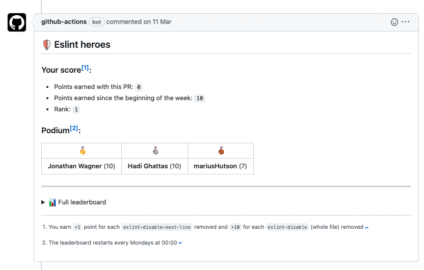

# 🛡 Eslint leaderboard (Github Action)

<p>
  <a href="https://github.com/actions/typescript-action/actions"></a>
</p>

---

Have you always wondered how to improve quality on your projects?

Look no further!

With this github action, you'll be able to automatically generate a leaderboard of your eslint heroes[^1] and add it to your pull requests.



> **Warning**
>
> Disclaimer, eslint is not perfect. Removing eslint warnings/errors might introduce regressions if not properly tested.

## 🏃 Quickstart

To use this github action, create a new workflow in your `.github` folder:

```yml
name: 'Eslint Heroes'

on: pull_request

jobs:
  pull-request-comment:
    runs-on: ubuntu-latest
    timeout-minutes: 3
    steps:
      - uses: actions/checkout@v3
        with:
          fetch-depth: 0
      - run: git checkout ${{ github.event.pull_request.base.ref }} # Necessary to add main in the git branches
      - run: git checkout ${{ github.event.pull_request.head.ref }} # Necessary to get the list of commits between head and master
      - uses: john-waitforit/action-eslint-leaderboard@v0.9.12
        id: 'action-eslint-leaderboard'
        with:
          ignorePattern: 'generated'
      - uses: marocchino/sticky-pull-request-comment@v2
        with:
          header: eslint-heroes # this is hidden, only used to update existing comment instead of creating new ones
          message: ${{ steps.action-eslint-leaderboard.outputs.pr-comment }}
```

This is it, open a PR with this change and you should see a comment posted within 3 minutes :)
Once merged, future PRs including this workflow will also have a leaderboard.

## 📝 Pre-requisites

This action relies on the git diff and the addition & removal on lines containing `eslint-disable`.

This means that if you have eslint rules set as warnings, they will not be counted in the leaderboard.

My recommendation is to set all your rules as errors (in your .eslint.json or equivalent config). When doing that, you will probably end up with a lot of outstanding errors blocking your CI. You can use [clinter](https://github.com/theodo/clinter) to automatically insert `eslint-disable` comments.

## ⚙️ How does it work?

Everything is computed on the fly so no server / database are needed.

The source of truth is your git history, this action simply goes through the commits and the git diff and counts the lines added/removed that contain `eslint-disable`.

Because it only computes the score of the current week the number of commits is reasonable (usually below 1 000) which means the action runs within 1 min.

[^1]: Eslint hero: nickname for an amazing dev removing eslint warnings and improving the codebase quality.
